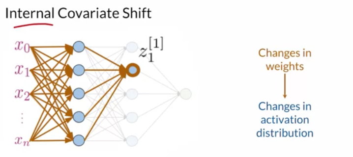
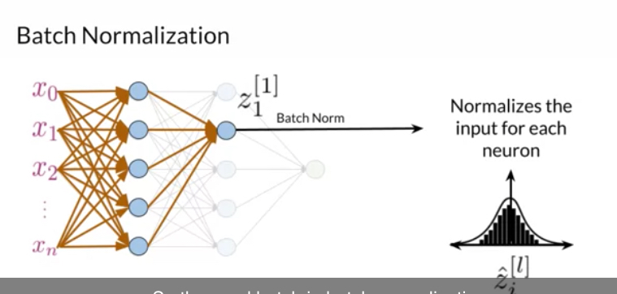
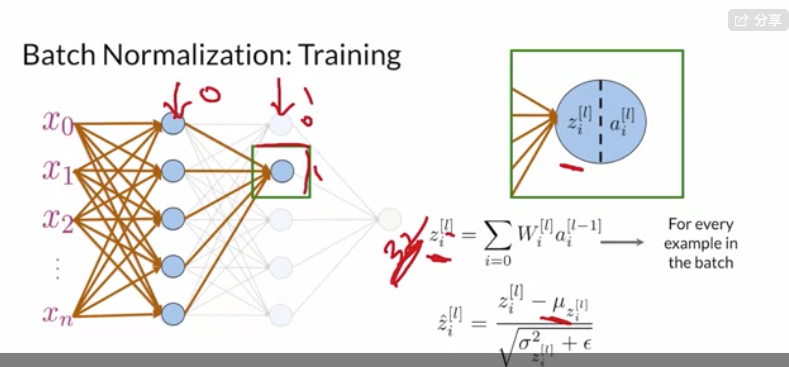

# Batch Normalization

- Batch Normalization smooths the cost function.
- Batch Normalization reduces the internal covariance shift.

> Covariance shift: changes in the distribution of one variable affect the distribution of related variables. 

However, covariate shift should not be a problem if just make sure that the distribution of your dataset is similar to the task you are modeling. However, for a neural network, the hidden weights are affected by the covariance shift.

- Batch Normalization speeds up learning.

The way to implement batch normalization:

$$
y_{i}^{[l]}=\gamma \hat{z}_{i}^{[l]}+\beta
$$
Where $\beta$ is a shift factor and $\gamma$ is a scale factor and $\epsilon$ here is to prevent that denominator from going to zero.

Batch normalization gives you control over you what that distribution of the data will look like moving forward in the neural networks.

-------

Summary 

- Batch norm introduces learnable shifts and scale factors.

  By introducing the learnable shifts parameters, we do not need to force target distribution to have zero-mean and and a standard deviation of one.

- During the test, the running statistics from training are used.

- Frameworks take care of the whole process.

  